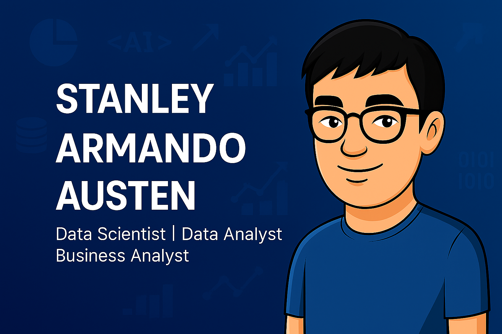

# Hi, I'm Stanley 👋👨🏻‍💻⭐

  

---

I'm a **Data Scientist** passionate about:

- Unlocking insights from data to drive meaningful decisions 
- Making data and machine learning accessible to everyone 
- Building tools and communities that empower analytical thinking 

Some technologies I love working with:
- **Python** (Pandas, NumPy, Scikit-learn, etc.)
- **SQL** for structured data exploration
- **Tableau & Kibana** for impactful visual storytelling

In **June 2025**, I completed my data science bootcamp with Hacktiv8, where I gained hands-on experience in data analysis, machine learning, and building end-to-end data solutions. The program sharpened my skills in Python, SQL, Tableau, and predictive modeling, while also strengthening my ability to solve real-world business problems with data.

I am also looking forward to applying these skills in a dynamic, data-driven environment where I can contribute to impactful projects, continue learning from experienced professionals, and grow into a well-rounded data professional.

---

## 🌎 Find Me Around the Web

- 📸 **Get to know about me on**: [My Instagram](https://www.instagram.com/stanleytenz)
- 💼 **My Portofolio**: [My Portofolio](https://stanleytenz.github.io/)
- 🔗 **Sharing on LinkedIn**: [My LinkedIn](https://www.linkedin.com/in/stanley-armando-45a039224/)

---

Let's build something amazing together! 🚀⭐
